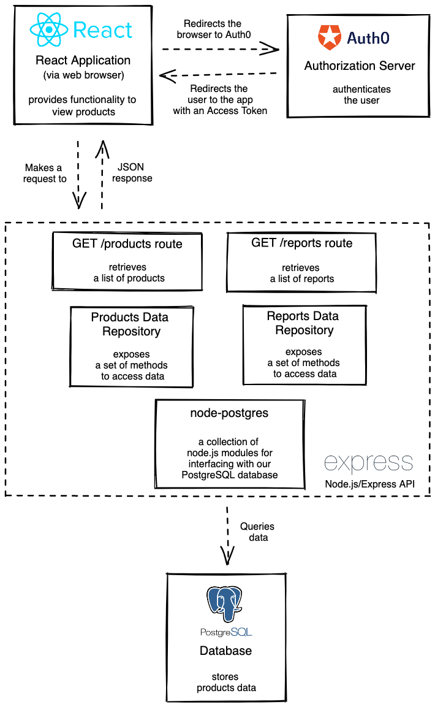

[](https://classroom.github.com/online_ide?assignment_repo_id=8230606&assignment_repo_type=AssignmentRepo)
# 03 Project - Cat Couture


- [03 Project - Cat Couture](#03-project---cat-couture)
  - [Scenario](#scenario)
  - [Brief](#brief)
    - [Architecture Diagram](#architecture-diagram)

## Scenario

Cat Couture is an online shop that specializes in the latest cat fashion. The client has asked for:

- A pagination feature, so that their customers can better view and link to the increasing variety of costumes that the shop now stocks
- An area of the site where their administrator can to log in and:
  - See the number of cat costumes in each product category that the shop sells
  - See the number of different products that are on promotion

Your tech lead has also warned you about some existing technical debt that you will need to fix.

---

## Brief

Implement the requested functionalities for stakeholders of the Cat Couture website, using the new full stack skills and development best practices you have learned.

### Architecture Diagram



---

## Getting Started

**To run the app:**

```zsh
docker-compose up --build
```

**To run the server-side tests:**

```zsh
docker-compose -f docker-compose.test.yml up --build
```

**To run the client-side tests:**

```zsh
cd client
npm install
npm test
```

---

## Instructions

### Part A - Pagination
  
Implement pagination.

**User Story**

- **As a** cat fashion enthusiast
- **I want** to see only some of the cat costumes first and use pagination to navigate through the rest of the cat costumes
- **So that** I am able to easily browse through the list of cat costumes

**Acceptance criteria**

- GIVEN that the cat costume shop has products,
  1. WHEN a user goes to the main products page, THEN the pagination control will be displayed.
  2. WHEN a user navigates to the first page of the products page, THEN the previous/back button of the pagination control will be disabled.
  3. WHEN a user goes to the main product page, THEN the current page will be highlighted in the pagination control.
  4. WHEN the user navigates to the second page of the main product page, THEN the previous/back button of the pagination control will be enabled.
  5. WHEN the user navigates to the last page of the main product page, THEN next button of the pagination control will be disabled.
  6. WHEN the user navigates to the next page of the main product page, THEN the previously displayed 10 products will not be displayed.
- GIVEN that the GET /products route exists,
  1. WHEN the client sends a request for a specific number or page of products which are valid as per the API spec, THEN return status 200, a correct list of products and information about pagination.
  2. WHEN the client sends a request for a specific number or page of products which are not valid as per the API spec, THEN return status 400 and an appropriate error message.
  
---

### Part B - Content Access
  
Only a logged in user who has `read:reports` permission can access the Dashboard page reports. Fortunately, your tech lead had already made a start on the dashboard page and completed some code.

**User Story**

- **As a** shop administrator
- **I want** to view information about my products
- **So that** I can manage my business

**Acceptance criteria**

1. Users who are not logged in are not able to see the Dashboard page.
2. Users who have the `read:reports` permission are able to see the reports in the Dashboard page.
3. Users who do not have the `read:reports` permission are not able to access the reports through the `/reports` endpoint or see the reports when they visit the Dashboard page.
